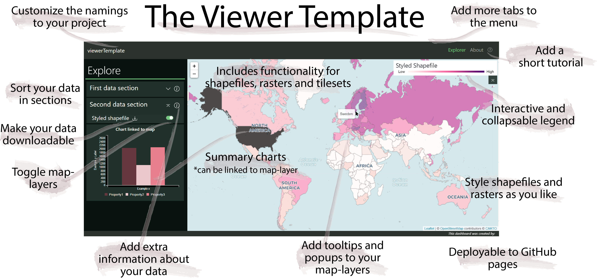

Demo: http://viz.naturalcapitalproject.org/viewerTemplate/

<br/>



<br/>

This is a template for creating your own interactive map-based viewer

<br/>

*Do you want your dashboard to be featured on the Natural Capital Project's [visualization gallery](http://viz.naturalcapitalproject.org/)? [Email us](mailto:chweil@stanford.edu) a link to your repo.*

# Set up 
[Detailed set up with images](Readme_step_by_step.md#Set-up)

1. Install [node.js](https://nodejs.org/en/download/), and a text editor (e.g  [VScode](https://code.visualstudio.com/download) )
2. Download or clone this repository and open the project directory in your text editor ([how to clone](https://docs.github.com/en/enterprise/2.13/user/articles/cloning-a-repository))
3. Open the terminal (Command Prompt in Windows) in your project directory and run `npm install` - this will install all dependencies
4. Run `npm start` -- this will run the app in the development mode.<br />
   Open [http://localhost:3000](http://localhost:3000) to view it in the browser. <br />
   The page will reload if you make edits.
   You will also see any errors in the console. <br />

# Customize viewer with your data
1. Use `src/data/data.js` to change configuration, add and organize your data (data goes in `src/data` folders). Details:

* [Workflow to edit configuration](https://github.com/charlottegiseleweil/viewerTemplate/blob/master/Readme_detailed.md#configure-basemap-and-parameters) (location, style of map etc)
* [Workflow to display vector (shapefile) data](https://github.com/charlottegiseleweil/viewerTemplate/blob/master/Readme_detailed.md#display-shapefiles)
* [Workflow to display raster data](https://github.com/charlottegiseleweil/viewerTemplate/blob/master/Readme_detailed.md#display-rasters)
* [Workflow to make & display tilesets](https://github.com/charlottegiseleweil/viewerTemplate/blob/master/Readme_detailed.md#build-and-display-tilesets) (for big rasters)
* [Workflow to make an interactive chart](https://github.com/charlottegiseleweil/viewerTemplate/blob/master/Readme_detailed.md#build-an-interactive-chart)

2. Customize text and appearance:
* [Workflow to edit or add menu tabs](https://github.com/charlottegiseleweil/viewerTemplate/blob/master/Readme_detailed.md#add-a-new-menu-tab) (in `src/App.js`)
* [Workflow to edit viewer's texts](https://github.com/charlottegiseleweil/viewerTemplate/blob/master/Readme_detailed.md#edit-texts) (in `src/components/Footer.js`, `src/components/AboutPage.js`, `src/components/Landing.js`, `src/components/LeftPanel.js`)

# Deploy viewer online 
[Detailed workflow with images](Readme_step_by_step.md#Deploy-viewer-online)
1. On github, create a new Github repository (you need to have a GitHub account). We'll deploy the viewer with GitHub pages.
2. In the `package.json` file, change the `homepage` property to `https://{username}.github.io/{repository-name}`. (e.g `"homepage": "https://myusername.github.io/myviewer"`)
3. Open your terminal/git bash and navigate to your project folder, change the remote url to your github repo: <br/>
   ```
   git remote set-url origin https://github.com/{username}/{repo-name}.git
   ```
4. Deploy your app (still in your bash, project directory), run: `npm run deploy` <br/>
   Yay!! Your app is now running at `https://{username}.github.io/{repo-name}/`
   -----> to update any changes `npm run deploy`
5. (Optional) Push the source code to your Github repo:
```
git add *
git commit -m "Your commit message"
git push origin master
```
*To have your viewer hosted on `viz.naturalcapitalproject.stanford.edu/{your-viewer}`, and featured in our visualization gallery, [email us](mailto:chweil@stanford.edu), including the link to your viewer.*
